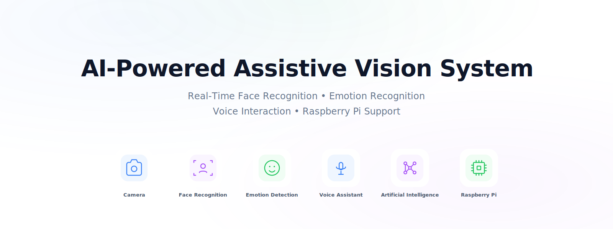
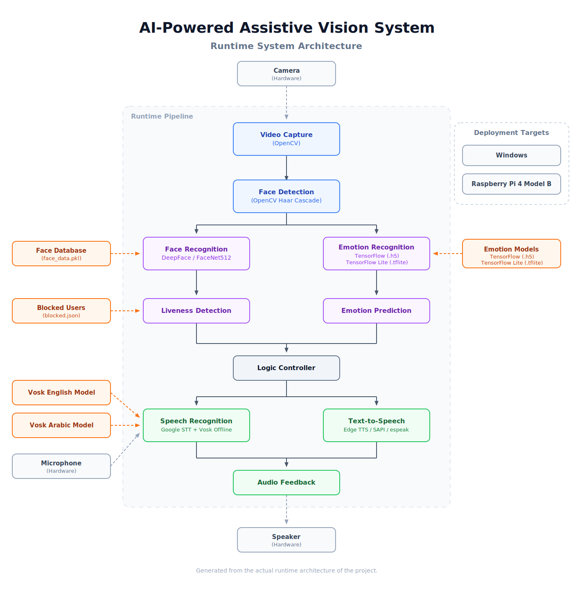

<p align="center">
  
</p>

<h1 align="center">
AI-Powered Assistive Vision System for Blind People
</h1>

## About the Project

The AI-Powered Assistive Vision System is a real-time, edge-deployable application designed to enhance environmental awareness for visually impaired users. By combining computer vision with a conversational voice interface, the system provides immediate, spoken feedback about the people in the user's surroundings.

At its core, the project integrates four primary AI technologies: **Face Recognition**, **Emotion Recognition**, **Speech Recognition (STT)**, and **Text-to-Speech (TTS)**. When a person is detected, the system recognizes known individuals, estimates facial emotions, and converts this contextual information into natural audio feedback.

Designed for reliable edge deployment, the architecture supports fully offline operation. It utilizes Vosk for local speech recognition and leverages TensorFlow Lite for optimized, on-device emotion prediction. The software is built to run on standard Windows environments as well as embedded hardware, offering full compatibility with the Raspberry Pi. This enables developers, students, and makers to deploy the system as a portable, standalone assistive device without relying on continuous cloud connectivity.


## Why This Project?

Navigating social environments presents unique challenges for visually impaired individuals, particularly when it comes to identifying people and interpreting non-verbal cues. This project was developed to address these challenges by providing a practical, open-source assistive vision tool.

By integrating computer vision and voice interaction, the system bridges the gap in situational awareness. The ability to recognize familiar faces and estimate emotional expressions allows users to better understand their immediate surroundings. Translating these visual signals into clear audio feedback provides actionable context during social interactions.

Furthermore, traditional cloud-dependent assistive devices often suffer from latency and require continuous internet connectivity. To prioritize reliability and portability, this project emphasizes offline operation. By running inference locally on edge devices like the Raspberry Pi, the system ensures consistent performance in environments with poor or no network coverage. This edge-based approach also helps preserve user privacy by processing audio and video streams locally instead of transmitting them to external services.

## ✨ Key Features

- **Real-Time Face Recognition:** Identifies known individuals directly from the camera feed using robust FaceNet512 embeddings. The system rapidly maps visual data to registered identities to keep the user informed.
- **Emotion Recognition:** Estimates facial emotional expressions from detected faces using a TensorFlow-based CNN model, providing contextual information through natural audio feedback.
- **Voice Interaction:** Combines Speech-to-Text (STT) and Text-to-Speech (TTS) to create a conversational interface. Users can issue voice commands to control the system and receive spoken feedback regarding their surroundings.
- **Offline AI Operation:** Executes models locally without requiring a continuous internet connection. By utilizing Vosk for speech recognition and TensorFlow Lite for emotion prediction, the application supports reliable operation even when internet connectivity is unavailable.
- **Raspberry Pi Compatibility:** Specifically optimized to run on resource-constrained embedded hardware like the Raspberry Pi 4. The Raspberry Pi deployment profile includes performance-oriented optimizations such as TensorFlow Lite inference and reduced runtime resource usage.
- **Guided Face Registration & Management:** Features a voice-prompted workflow to easily add, manage, block, or remove known faces from the local database. Users can seamlessly update identity records using natural voice commands.
- **Modular Software Architecture:** Built with clean separation of concerns among the vision, voice, and logic controller components. This structural design simplifies maintenance and makes it easy for developers to extend or replace individual modules.
- **Multilingual Support:** Supports English and Arabic speech recognition using online and offline speech pipelines, together with multilingual voice feedback where configured.

## 🛠️ Tech Stack

| Category | Technologies | Purpose |
|----------|--------------|---------|
| Programming Language | `Python` | Core application logic and module integration |
| Computer Vision | `OpenCV` (Primary), `MTCNN` (Optional) | Camera access, image processing, and face detection. |
| Deep Learning | `TensorFlow`, `Keras` | Neural network inference for emotion prediction models |
| Face Recognition | `DeepFace (FaceNet512)` | Extracting facial embeddings and managing identity verification |
| Speech Recognition | `SpeechRecognition`, `Vosk` | Converting spoken commands into text via online and offline pipelines |
| Text-to-Speech | `Edge-TTS`, `Windows SAPI (pywin32)`, `espeak/espeak-ng` | Natural speech synthesis with platform-specific fallback engines. |
| Image Processing | `Pillow`, `scikit-image` | Unicode-safe text rendering and image annotation. |
| Audio Processing | `PyAudio`, `SoundDevice`, `librosa` | Microphone input and optional audio feature extraction. |
| Edge Deployment | `TensorFlow Lite` | Optimized, low-resource model inference on the Raspberry Pi |
| Runtime / Utilities | `NumPy`, `PyGame`, `arabic-reshaper`, `python-bidi` | Numerical computation, audio playback, and Arabic text rendering. |

## 🏗️ System Architecture

The runtime execution flow is orchestrated by a centralized Logic Controller that synchronizes multiple concurrent AI pipelines to provide responsive real-time operation. As visual data streams in, the computer vision module quickly isolates targets, passing cropped frames to the dedicated face recognition and emotion recognition networks. Instead of processing these streams in isolation, the Logic Controller evaluates recognition results and estimated emotional expressions against local database configurations to determine the appropriate system reaction. Simultaneously, the speech recognition engine continuously listens for user instructions. When the system needs to convey information—whether responding to a voice command or automatically announcing a recognized person's presence—the logic controller delegates the generated text to the text-to-speech component. This ensures that visual analytics and voice interactions are continuously interwoven into a seamless assistive experience.

### Architecture Diagram



### Runtime Pipeline Summary

| Stage | Description |
|-------|-------------|
| 1. Camera Input | Captures real-time video frames from the hardware camera. |
| 2. Face Detection | Isolates individual faces within the captured video frame. |
| 3. Face Recognition | Computes facial embeddings to identify the person against local records. |
| 4. Emotion Recognition | Evaluates the detected face to predict the current emotional expression. |
| 5. Logic Controller | Synchronizes vision data, processes rules, and manages the system state. |
| 6. Speech Recognition | Processes microphone audio to interpret spoken commands from the user. |
| 7. Text-to-Speech | Synthesizes natural speech from text messages generated by the controller. |
| 8. Audio Feedback | Plays the resulting speech synthesis back to the user via speakers. |

For a comprehensive explanation of the runtime workflow, module interactions, and AI pipelines, see [`docs/ARCHITECTURE.md`](docs/ARCHITECTURE.md).

## 💻 Hardware & Deployment Targets

### Supported Platforms

| Platform | Supported | Notes |
|----------|-----------|-------|
| Windows 10/11 | ✅ Yes | Recommended for development and standard desktop execution. |
| Raspberry Pi 4 Model B | ✅ Yes | Optimized runtime profile with TensorFlow Lite inference and reduced resource usage. |

### Required Hardware

| Component | Purpose |
|-----------|---------|
| Camera | Captures real-time video streams for face and emotion recognition. |
| Microphone | Captures user speech input for voice interactions and commands. |
| Speaker / Headphones | Provides natural audio feedback generated by the Text-to-Speech engine. |

### Deployment Notes

The assistive vision system supports dual execution modes natively: a standard desktop environment and a lightweight edge deployment targeting the Raspberry Pi. When executing on Windows, the software uses the standard desktop runtime profile with the full TensorFlow model and a desktop-oriented configuration. Conversely, the Raspberry Pi deployment leverages a performance-oriented runtime profile explicitly designed for resource-constrained hardware. By utilizing TensorFlow Lite inference models and headless OpenCV, the edge deployment minimizes memory footprint and CPU overhead. This deployment profile keeps the core functionality suitable for resource-constrained environments while maintaining feature parity with the desktop version where practical.

## 📦 Installation & Setup

## Prerequisites

- Python 3.12 (required by the current Windows scripts)
- Git
- Camera
- Microphone
- Speaker / Headphones

> **Note**
>
> AI models are distributed separately because of their size and are not included in the Git repository.

## Windows Installation

1. Clone the repository:
   ```bash
   git clone <repository-url>
   cd <repository-folder>
   ```
2. Download the required AI models and place them in the appropriate locations inside the `models/` directory before launching the application.
3. Run `install.bat`.
4. Launch the application using `run.bat`.

*Note: The Windows scripts currently use `py -3.12`.*

## Raspberry Pi Installation

1. Clone the repository:
   ```bash
   git clone <repository-url>
   cd <repository-folder>
   ```
2. Run `install_pi.sh`.
3. Download the required AI models and place them in the appropriate locations inside the `models/` directory before launching the application (or use `download_models.sh` if available).
4. Launch the application using `run_pi.sh`.

*Note: The Raspberry Pi setup creates and uses a `.venv` virtual environment automatically.*

## AI Models

- AI models are not stored in Git because of file size.
- They must be downloaded separately.
- Place them inside the `models/` directory.
- `download_models.sh` is provided as a helper for Linux/Raspberry Pi users.

## Notes

- Windows uses the standard desktop runtime.
- Raspberry Pi uses the optimized TensorFlow Lite runtime profile.
- The Raspberry Pi launcher automatically configures environment variables for edge deployment.
- The application expects the required AI models to be available before startup.

## 🚀 Running the Application

### Windows

From the project root directory, run:

```bat
run.bat
```

Upon execution, the system initializes the camera and loads the necessary AI models into memory. Once initialization is complete, the application enters its main processing loop, continuously analyzing camera frames while listening for voice interactions.

### Raspberry Pi

From the project root directory, run:

```bash
./run_pi.sh
```

The launcher automatically activates the virtual environment when available. It then configures the Raspberry Pi runtime profile, enables the TensorFlow Lite execution path, and starts the application.

### Voice Interaction

The user interacts with the system entirely hands-free using a conversational interface. The process begins with a wake word, after which the system actively listens for supported voice commands. The logic controller translates these commands into actions and provides status updates or contextual information through spoken responses. This interface also provides a comprehensive face management workflow, allowing users to register new identities, improve existing profiles, delete records, and block or unblock identities entirely through voice input.

### Runtime Behavior

| Stage | Description |
|-------|-------------|
| Camera Initialization | Connects to the primary hardware camera to begin capturing video frames. |
| Face Detection | Scans the video stream to locate and isolate human faces. |
| Face Recognition | Compares detected faces against registered identities to identify individuals. |
| Emotion Recognition | Analyzes facial features to estimate the current emotional expression. |
| Speech Recognition | Continuously processes audio input to detect wake words and voice commands. |
| Logic Controller | Synchronizes vision and audio data to manage the application state. |
| Text-to-Speech | Generates spoken audio feedback for the user based on system events. |
| Graceful Shutdown | Safely releases hardware resources and terminates background threads upon exit. |

## 📸 Screenshots

The following gallery provides a visual overview of the assistive vision system during real-world operation. The screenshots illustrate the desktop interface, AI inference pipeline, voice interaction workflow, and the Raspberry Pi deployment profile.

| Screenshot | Description | Status |
|------------|-------------|--------|
|  | Displays the primary application window and its general layout. | Coming Soon |
|  | Highlights real-time face tracking and identity matching. | Coming Soon |
|  | Demonstrates facial expression analysis and emotion prediction overlays. | Coming Soon |
|  | Shows the visual feedback loop during active voice commands. | Coming Soon |
|  | Shows the application running on the Raspberry Pi using the optimized edge deployment profile. | Coming Soon |

> [!NOTE]
> Screenshots will be added after the application's user interface and deployment workflow have been finalized and validated.

## 🎙️ Voice Commands

The assistive vision system supports fully bilingual voice interaction, allowing users to issue commands seamlessly in either English or Arabic. Instead of requiring complex manual inputs, the application relies on a comprehensive suite of predefined commands to facilitate core system control and intuitive face management operations. Users can easily activate the system using a dedicated wake word, after which they can manage registered identities, dynamically switch the active language, control the audio feedback behavior, or initiate new identity registrations entirely hands-free. This voice-first architecture ensures that the application remains accessible, robust, and exceptionally easy to navigate for all users.

| Category | Example Commands | Description | Language | Offline Support |
|----------|------------------|-------------|----------|:---------------:|
| **Wake Word** | `vision`, `ابدأ فيجن` | Activates the voice session for issuing direct commands. | EN / AR | ✅ Yes |
| **Registration** | `register`, `سجل` | Starts the workflow to register a new face identity. | EN / AR | ✅ Yes |
| **Management** | `improve person`, `حسن التسجيل` | Updates an existing face profile with new visual data. | EN / AR | ✅ Yes |
| **Management** | `delete`, `احذف` | Removes a registered identity from the local database. | EN / AR | ✅ Yes |
| **Management** | `delete all`, `امسح الكل` | Wipes the entire identity database (requires confirmation). | EN / AR | ✅ Yes |
| **Management** | `block`, `احظر` | Blocks a specific person so their presence is ignored. | EN / AR | ✅ Yes |
| **Management** | `unblock`, `فك حظر` | Removes the block on a previously restricted identity. | EN / AR | ✅ Yes |
| **Identification** | `who is this`, `مين ده` | Manually triggers an identification of the person in frame. | EN / AR | ✅ Yes |
| **Identification** | `list names`, `اسماء` | Recites a numbered list of all currently registered names. | EN / AR | ✅ Yes |
| **App Behavior** | `switch to arabic`, `عربي` | Switches the system language and speech engine to Arabic. | EN / AR | ✅ Yes |
| **App Behavior** | `switch to english`, `انجليزي` | Switches the system language and speech engine to English. | EN / AR | ✅ Yes |
| **App Behavior** | `english female voice`, `صوت رجالي عربي` | Changes the gender of the Text-to-Speech audio output. | EN / AR | ✅ Yes |
| **App Behavior** | `pause`, `هدوء` | Pauses automatic face and emotion presence announcements. | EN / AR | ✅ Yes |
| **App Behavior** | `resume`, `تابع` | Resumes automatic environmental presence announcements. | EN / AR | ✅ Yes |
| **App Behavior** | `quiet`, `اسكت` | Immediately silences the current audio playback. | EN / AR | ✅ Yes |
| **App Behavior** | `close vision`, `اغلق` | Closes the active voice session and returns to standby. | EN / AR | ✅ Yes |

### Command Recognition

To deliver a highly responsive conversational interface, voice commands are organized into distinct, predefined categories corresponding to specific application features. Rather than enforcing strict vocabulary rules, the command parser inherently supports a wide variety of synonyms for each underlying action, enabling users to speak naturally.

To further enhance reliability, the system employs an intelligent fuzzy matching algorithm. This tolerates minor variations in pronunciation and inevitable transcription inaccuracies from the speech-to-text engines. When processing Arabic input, the parser executes a deep text normalization routine that strips diacritics, unifies character variants, and standardizes numerals. This ensures that regional dialects and subtle phonetic differences do not break the command recognition pipeline. For developers looking to customize the experience, introducing new capabilities is straightforward. A new command can be seamlessly integrated by simply extending the existing synonym lists and updating the offline grammar vocabulary, ensuring continuous offline support without complex structural changes.

## 📁 Project Structure

The repository is organized to maintain a clean separation of concerns, ensuring that source code, AI assets, and developer utilities are neatly segregated.

```text
.
├── assets/
├── docs/
├── logs/
├── models/
├── src/
│   ├── camera/
│   ├── config/
│   ├── emotion/
│   ├── face_recognition/
│   ├── utils/
│   ├── voice/
│   └── main.py
├── tools/
├── tts_cache/
├── README.md
├── requirements.txt
├── requirements-pi.txt
├── install.bat
├── install_pi.sh
├── run.bat
├── run_pi.sh
├── download_models.sh
└── LICENSE
```

> Runtime-generated directories such as `logs/` and `tts_cache/` are created automatically during execution and are not part of the core source code.

| Path | Purpose |
|------|---------|
| `src/` | Contains the primary application source code, including `main.py` and modular subsystems. |
| `models/` | Stores all heavy AI model weights locally, including TensorFlow and Vosk models. |
| `docs/` | Houses comprehensive technical documentation and architecture specifications. |
| `assets/` | Serves as the central repository for graphical assets such as application icons and screenshots. |
| `tools/` | Intended strictly for developer utilities (e.g., model conversion, hardware diagnostics) rather than the application runtime. |
| `logs/` | *(Runtime Generated)* Local debugging and operational application logs. |
| `tts_cache/` | *(Runtime Generated)* Audio cache used by the Text-to-Speech engine to minimize latency. |
| root scripts | Installation and launch scripts (`.bat` and `.sh`), dependency definitions (`requirements.txt`), and core project files. |

The architecture emphasizes a clean separation between the active application source (`src/`), heavy AI assets (`models/`), extensive technical documentation (`docs/`), visual assets (`assets/`), and developer utilities (`tools/`). Runtime-generated data, such as `logs/` and `tts_cache/`, are strictly isolated from the source tree. This modular design promotes straightforward navigation and long-term maintainability across different deployment targets.

## 📚 Documentation & Resources

For deeper insights into the project, we provide dedicated resources tailored to both end users and developers. Please refer to the following documents for comprehensive guides, technical specifications, and architectural details.

### User Documentation

- [`RASPBERRY_PI_SETUP.md`](docs/RASPBERRY_PI_SETUP.md) — Provides step-by-step deployment and runtime instructions specifically designed for Raspberry Pi hardware.

### Developer Documentation

- [`SYSTEM_DOCUMENTATION.md`](docs/SYSTEM_DOCUMENTATION.md) — Offers a highly technical overview of the machine learning models, liveness checks, and latency optimizations.
- [`ARCHITECTURE.md`](docs/ARCHITECTURE.md) — Explains the internal runtime architecture, module interactions, and the complete AI execution pipeline.

**Developer References**

- [`FACE_RECOGNITION_DISCUSSION.md`](docs/FACE_RECOGNITION_DISCUSSION.md) — Details the technical rationale, trade-offs, and design choices regarding the face recognition implementation.
- [`FACE_EMOTION_DISCUSSION.md`](docs/FACE_EMOTION_DISCUSSION.md) — Explores the technical decisions and design rationale underlying the emotion classification pipeline.

We strongly encourage developers to review the technical documentation and reference materials thoroughly before modifying the core system architecture.

## 🔮 Future Improvements

The following areas represent logical extensions to the current architecture to further enhance reliability, accessibility, and performance.

### AI Improvements
- Enhance the offline speech recognition pipeline to improve open-vocabulary recognition during identity registration.
- Upgrade the emotion classifier to analyze temporal sequences and micro-expressions across multiple frames.

### Performance Optimizations
- Add support for optional hardware AI accelerators (such as Google Coral Edge TPU) for improved edge inference performance.
- Implement INT8 model quantization for the DeepFace embedding extractor to reduce memory usage on edge devices.

### Accessibility
- Introduce spatial distance estimation to inform the user how far away a recognized person is standing.
- Allow users to dynamically adjust the Text-to-Speech speaking rate through simple voice commands.

### Deployment
- Containerize the application using Docker to streamline cross-platform setup and audio dependency management.

### Developer Experience
- Transition the hardcoded configuration system to a dynamic format to simplify rapid parameter tuning without modifying source code.
