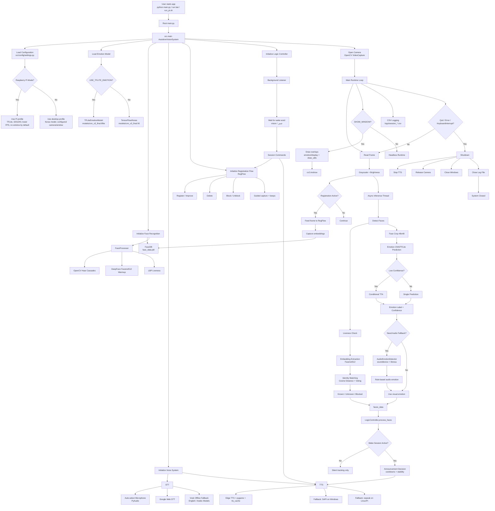

# System Architecture

This document describes the internal architecture of the AI-Powered Assistive Vision System.

It explains how the application's modules interact, how data flows through the system, and how AI components are integrated into the runtime.

Runtime Architecture Report
1. Main Execution Flow
main.py is the root entry point.
It imports AssistiveVisionSystem from src/main.py.
AssistiveVisionSystem.__init__() initializes:Emotion model: TFLite on Raspberry Pi if enabled, otherwise Keras .h5.
FaceDB: loads registered face embeddings from face_data.pkl.
FaceProcessor: loads Haar Cascade and warms up DeepFace Facenet512.
STT: selects microphone, prepares Google STT and Vosk fallback.
RegFlow: handles register, improve, delete, block, unblock flows.
AudioEmotionDetector: optional microphone-based emotion fallback.
LogicController: starts background command listener.
CSV logging in logs/.

AssistiveVisionSystem.run() opens the camera using OpenCV.
Main loop:Reads frame.
Converts frame to grayscale.
Calculates brightness.
Feeds frame to registration flow if active.
Runs face/emotion inference asynchronously.
Sends recognized faces and emotions to LogicController.
Draws results if display window is enabled.
Exits on Q, ESC, or KeyboardInterrupt.

Shutdown:Sets shutdown flag.
Stops TTS.
Releases camera.
Destroys OpenCV windows.
Closes log file.

2. Major Modules And Responsibilities
main.py: Thin launcher for backward compatibility.
src/main.py: Main runtime orchestrator; camera loop, inference scheduling, logging, display, shutdown.
src/config/settings.py: Central configuration; camera, model paths, thresholds, STT/TTS settings, Raspberry Pi profile.
config.py: Compatibility wrapper that exposes src.config.settings.
src/face_recognition/face_db.py: Thread-safe persistent face database using face_data.pkl.
src/face_recognition/face_processor.py: Face detection, liveness check, embedding extraction, identity matching, voting.
src/face_recognition/registration.py: Voice-guided registration, improvement, deletion, blocking, unblocking.
src/emotion/audio_detector.py: Optional audio-based emotion fallback.
src/emotion/display.py: Draws emotion, confidence, FPS, and face overlays.
src/voice/stt.py: Microphone selection, Google Web STT, Vosk fallback, name capture, yes/no capture.
src/voice/tts.py: Speech output queue, Edge TTS, SAPI fallback on Windows, espeak fallback on Linux/Raspberry Pi.
src/voice/logic_controller.py: Wake word/session state, command parsing, announcements, auto-speech throttling.
src/utils/model_runtime.py: TFLite wrapper with predict() compatibility.
src/utils/draw_utils.py: Unicode/Arabic-safe text drawing with Pillow.
tools/rpi_preflight.py: Raspberry Pi readiness check.
tools/rpi_deep_test.py: Deeper Raspberry Pi environment/runtime diagnostics.
3. Data Flow Between Modules
Camera frame enters src/main.py.
Frame goes to FaceProcessor.detect().
Detected face boxes go to:FaceProcessor.is_live()
FaceProcessor.embed()
emotion model prediction

Face embedding goes to FaceProcessor.identify() with data from FaceDB.all().
Emotion prediction returns emotion label and confidence.
Combined face data becomes:name
recognition score
emotion
emotion confidence
face box
face area

This data is passed to LogicController.process_faces().
LogicController decides whether to speak, stay silent, register, delete, block, or answer commands.
TTS messages go to TTS.say() or TTS.say_wait().
Voice commands go through STT.listen(), then Google STT or Vosk fallback.
Registration flow receives frames through RegFlow.feed() and writes embeddings through FaceDB.add().
4. External Components
Camera: OpenCV VideoCapture, configured by CAMERA_INDEX, width, height, FPS.
Microphone: SpeechRecognition + PyAudio; optional audio emotion via sounddevice.
Speaker/audio output:Edge TTS MP3 playback via pygame.
Windows SAPI via pywin32.
Linux/Raspberry Pi fallback via espeak-ng or espeak.

Models:Emotion CNN .h5
Emotion TFLite .tflite
DeepFace Facenet512
Vosk English model
Vosk Arabic model

Storage:face_data.pkl for registered embeddings.
blocked.json for blocked identities.
logs/session_*.csv for runtime logs.
tts_cache/ for generated speech files.

Raspberry Pi:run_pi.sh enables Pi mode, TFLite, lower resolution, reduced FPS, no display window by default, and performance-related env vars.

5. AI Models Used
Emotion CNN:Path: models/cnn_v3_final.h5
Called in src/main.py
Loaded through TensorFlow/Keras when TFLite is disabled or unavailable.

Emotion TFLite:Path: models/cnn_v3_final.tflite
Loaded through TFLiteEmotionModel in src/utils/model_runtime.py
Used by default in Raspberry Pi mode.

DeepFace Facenet512:Used in src/face_recognition/face_processor.py
Called by DeepFace.represent()
Produces face embeddings for recognition.

Vosk English:Path: models/vosk-model
Used in src/voice/stt.py as offline fallback.

Vosk Arabic:Path: models/vosk-model-ar-mgb2-0.4
Used in src/voice/stt.py as Arabic offline fallback.

6. Speech Recognition Flow
STT.__init__() creates speech_recognition.Recognizer.
It auto-selects microphone using PyAudio device inspection.
It initializes Vosk models in background.
It starts an online checker for Google availability.
LogicController starts a background listener.
Listener waits for wake word: vision, start vision, فيجن, etc.
STT.listen() records audio from microphone.
Audio is filtered:Too short audio is ignored.
Too quiet audio is ignored.
Vosk noise-like command phrases can be ignored.

If online and Google is allowed:Google STT tries current language first.
If unclear, it may fallback to the other language.

If Google fails or system is offline:Vosk is used.

Result text goes to LogicController._handle_command().
Special helpers:yes_no() validates confirmation responses.
get_name() captures person names and cleans/transliterates Arabic names when needed.

7. Text-To-Speech Flow
Global tts = TTS(rate=config.TTS_RATE) is created in src/main.py.
TTS starts a worker thread and queue.
Messages are sent through:say() for non-blocking output.
say_wait() for blocking prompts.

Preferred path:Edge TTS generates MP3.
MP3 is cached in tts_cache/.
pygame.mixer plays the MP3.

Fallbacks:Windows: SAPI via win32com.client.
Linux/Raspberry Pi: espeak-ng or espeak.
Last fallback: print text only.

Quiet mode:LogicController can call tts.set_quiet(True).
Non-critical announcements are suppressed.
System prompts can still use say_wait().

8. Face Recognition Flow
FaceProcessor.detect() detects frontal and profile faces using Haar Cascades.
Main inference thread sorts/limits faces if configured.
FaceProcessor.is_live() performs LBP texture liveness check.
FaceProcessor.embed() extracts face embedding:Primary: DeepFace Facenet512.
Fallback: pixel-based embedding if DeepFace is unavailable.

FaceDB.all() provides stored embeddings.
FaceProcessor.identify():Computes cosine distance between live embedding and stored embeddings.
Uses best matches and weighted average distance.
Applies threshold, gap ratio, single-person thresholds, and recent-hold logic.
Uses vote buffer to stabilize identity.

Blocked identities are checked separately with identify_blocked().
Final name is sent to LogicController.
Registration/improvement:RegFlow captures guided samples from multiple angles/expressions.
Embeddings are added to FaceDB.
Database is saved to face_data.pkl.

9. Emotion Recognition Flow
Face crop is taken from grayscale frame.
Face is resized to config.IMG_SIZE, currently (48, 48).
Pixel values are normalized.
Multiple face crops are batched.
Emotion model predicts class probabilities.
If confidence is low, _predict_emotion() may run TTA:Original face.
Flipped face.
Brightness-adjusted versions.

Raw class index maps to config.EMOTIONS_EN.
Per-face smoothing uses short history.
If visual emotion confidence is low and STT is not listening:AudioEmotionDetector.analyze_async() may run.
Audio emotion is rule-based using energy, pitch, ZCR, and MFCC-related features.

LogicController controls when emotion changes are announced to avoid repeated speech.
10. Configuration Loading Flow
Runtime modules import config.
Root config.py exposes settings from src/config/settings.py.
settings.py reads defaults and environment variables.
Raspberry Pi mode is detected by:VISION_RPI
VISION_RPI_MODE
ARM/aarch64 platform detection

If RPI_MODE is enabled:Camera index defaults to 0.
Resolution becomes 320x240.
Target FPS becomes 10.
Window display defaults to off.
TFLite emotion model is enabled.
Face recognition and inference intervals are relaxed for performance.

run_pi.sh sets Raspberry Pi-specific environment variables before running python main.py.

