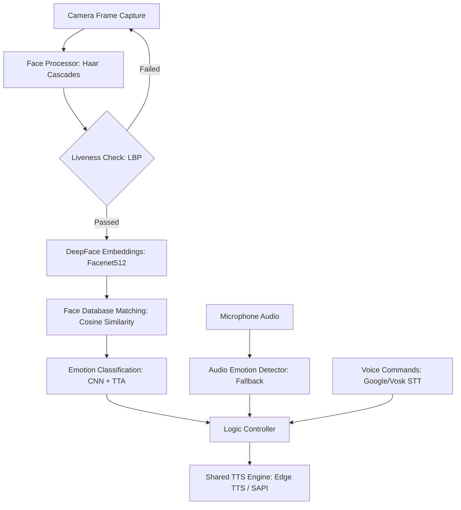

# SYSTEM DOCUMENTATION: Assistive Vision System (v6 Final)

This document provides a comprehensive technical overview of the **Assistive Vision System**—a wearable smart assistant designed to aid visually impaired and blind users in social interactions. It details the system architecture, mathematical methods, machine learning models, database structure, and the latest robustness and latency optimizations implemented in the final version.

---

## 1. Project Overview & Objective
The **Assistive Vision System** is a real-time, wearable solution that acts as the "eyes" of a visually impaired person. 
* **Core Goal:** Detect and identify people in the user's field of view, analyze their facial expressions (emotions), and announce the results via natural Text-to-Speech (TTS) neural voices.
* **Control Interface:** Fully hands-free operation using voice commands (bilingual English/Arabic STT) with offline fallback capability.

---

## 2. Technical System Architecture

The software pipeline consists of five major integrated modules:

### A. Face Processor (`face_processor.py`)
1. **Face Detection:** Uses **Haar Cascade Classifier** (`haarcascade_frontalface_default.xml`) for fast facial region detection (~5ms). Gray frames are pre-processed using a pre-computed Gamma Correction Look-Up Table (LUT) to enhance details in low-contrast frames.
2. **Liveness Verification:** Uses **Local Binary Patterns (LBP)** texture analysis. It extracts a Uniform LBP histogram from the face Region of Interest (ROI) and calculates the variance. If `variance >= 18.0`, the face is verified as live (3D surface) to prevent spoofing via printouts or screens.
3. **Face Embedding:** Uses **Facenet512** via DeepFace. It crops the verified face, resizes it, and extracts a 512-dimensional normalized feature vector (embedding) on a background thread (~120ms).
4. **Face Matching:** Calculates the **Cosine Distance** between the runtime embedding ($E_r$) and the registered embeddings ($E_s$) stored in the database:
   $$\text{Cosine Distance} = 1 - \frac{E_r \cdot E_s}{\|E_r\|\|E_s\|}$$
   * A weighted average of the top 5 closest distances is calculated.
   * If the distance is $\le 0.50$, the person is identified. If the distance is $\le 0.35$ and matches a blocked entry, the person is classified as **Blocked**.
5. **Spatial Voting Algorithm:** Maintains a rolling buffer of the last 7 identification results per grid cell (80px spatial resolution). The final name announced is the majority vote (ratio $\ge 55\%$) of this buffer, preventing identity flickering.

### B. Emotion Classifier (`main.py` & `emotion/`)
1. **CNN Architecture:** Real-time emotion classification is done using a custom CNN trained on the FER-2013 dataset, outputting probabilities for 7 classes (*Angry, Disgust, Fear, Happy, Neutral, Sad, Surprise*).
2. **Test-Time Augmentation (TTA):**
   * **Adaptive TTA:** To maintain responsiveness, the model first performs a single fast prediction (~50ms).
   * If the maximum probability (confidence) is $< 0.55$, it runs a 5-pass TTA pipeline (~250ms) consisting of:
     1. Original image
     2. Horizontal flip
     3. Brightness $+10\%$
     4. Brightness $-10\%$
     5. Gaussian noise addition
   * The average of these 5 passes determines the final emotion, increasing classification accuracy under non-ideal lighting.
3. **Audio Fallback (`AudioEmotionDetector`):** If the face recognition confidence is low ($< 0.45$) or in very dark environments, the system triggers the microphone to capture a 2-second audio clip. It extracts acoustic features (Energy/RMS, Pitch tracking via YIN, and Zero Crossing Rate) to classify the speaker's emotion.

### C. Logic Controller (`logic_controller.py`)
* Processes facial data and coordinates audio announcements.
* Implements a **announcement queue** to schedule TTS readings without overlaps.
* Implements a **cooldown timer** (3.0 seconds) to prevent repetitive announcements of the same person/emotion.
* Handles the state machine of the voice session (Idle vs. Active session).

### D. Shared TTS Engine (`shared/tts.py`)
* Uses **Edge TTS (Neural Voices)** as the primary engine:
  * Arabic Female: `ar-EG-SalmaNeural`
  * Arabic Male: `ar-EG-ShakirNeural`
  * English Female: `en-US-AriaNeural`
  * English Male: `en-US-GuyNeural`
* **Caching Pipeline:** Generates an MD5 hash of the phrase and saves the synthesized neural audio as an MP3. Subsequent requests load the cached MP3 in 0ms, eliminating network delays.
* **Fallbacks:** If offline, it falls back to **SAPI (SpVoice)** on Windows or **espeak-ng** on Linux.

### E. Speech-To-Text (STT) Engine (`shared/stt.py`)
* **Online Mode:** Google Speech Recognition API with a 3.5s timeout.
* **Offline Mode:** Vosk API running local acoustic models (`vosk-model` for English, `vosk-model-ar` for Arabic) loaded as a background thread on startup.

---

## 3. Core Features & Custom Speech Commands

The system is fully bilingual (English/Arabic). The user can control all features hands-free:

| English Command | Arabic Command | Action Description |
| :--- | :--- | :--- |
| **vision / start vision** | **ابدأ فيجن / فيجن** | Wakes up the system and opens the active voice session |
| **close system / goodbye** | **اغلق / مع السلامة** | Closes the voice session and puts the STT to sleep |
| **english** | **انجليزي** | Switches TTS and STT interface language to English |
| **arabic** | **عربي** | Switches TTS and STT interface language to Arabic |
| **register / learn** | **سجل / تسجيل** | Registers the new face in front of the camera (80 shots guidance) |
| **delete / remove** | **احذف / امسح** | Removes a registered person from the database |
| **block / ban** | **احظر / حظر** | Places the person in front of the camera on the block list |
| **unblock / allow** | **فك حظر / رفع الحظر** | Removes a person from the block list |
| **who / identify** | **مين / عرفني** | Identifies the name and emotion of the closest person |
| **list / names** | **قائمة / الاسماء** | Reads the list of all registered persons |
| **quiet / mute** | **اسكت / صمت** | Enters quiet mode (stops spontaneous facial announcements) |
| **speak / resume** | **اتكلم / كمل** | Exits quiet mode and resumes facial announcements |
| **male voice** | **صوت رجالي** | Switches the TTS voice to male |
| **female voice** | **صوت نسائي** | Switches the TTS voice to female |

---

## 4. Final Optimizations & Robustness Updates

The final version implements critical refinements to guarantee stability and high responsiveness under non-ideal real-world conditions:

### A. Low-Light Liveness Bypass (LBP Refinement)
* **Problem:** In dark rooms (brightness $< 55.0$), camera sensors produce high noise and lose facial textures. This causes LBP texture analysis to fail, falsely classifying real faces as non-live (spoofs) and locking the user out.
* **Optimization:** Added real-time brightness checking of the face ROI. If `face_brightness < 55.0`, the system automatically bypasses the LBP check (returns `True`). This ensures the system remains functional in low-light environments without ignoring users.

### B. Microphone Concurrency Lock
* **Problem:** If the camera detected low confidence, it triggered `AudioEmotionDetector` to record audio via the `sounddevice` library. If the user spoke a command at the same time, the `SpeechRecognition` library (PyAudio) also tried to open the microphone, resulting in a PortAudio resource conflict and system freeze.
* **Optimization:** Added an `is_listening` state flag in `STT`. The main loop checks this flag and refuses to start the audio emotion recording if the STT engine is actively capturing voice commands, preventing mic channel conflicts.

### C. Offline Fallback Socket Timeout (3.5 seconds limit)
* **Problem:** If internet connection is sluggish or poor, calling Google STT blocked the thread for up to 30 seconds, causing severe lags in user interaction.
* **Optimization:** Wrapped Google Speech API calls in a socket timeout limit of `3.5` seconds. If the API does not respond within this window, it immediately triggers the local offline **Vosk** engine, preserving responsiveness.

### D. Vosk Acoustic State Reset
* **Problem:** During consecutive commands, Vosk carried over residual audio signals or silence, causing subsequent commands to misclassify or fail to trigger unless repeated multiple times.
* **Optimization:** Integrated `rec.Reset()` before feeding the audio waveform to Vosk's `KaldiRecognizer`. This clears the audio context buffers between sentences, making offline recognition highly responsive on the first try.

### E. Pygame Mixer Thread Safety & Cache Integrity
* **Problem:** Under poor network connectivity, a file generation timeout could result in an empty (0-byte) or corrupted `.mp3` file in the `tts_cache` directory. The next time the phrase was spoken, Pygame mixer attempted to load this corrupted file, causing the Python process to crash or close silently.
* **Optimization:**
  * Added validation in `tts.py` to check the cached file size. If `os.path.getsize(path) == 0`, the corrupted file is deleted and regenerated.
  * Added a thread lock (`self._mixer_lock`) to serialize Pygame mixer `load()`, `play()`, and `stop()` commands. Polling `get_busy()` is executed outside of the lock, enabling non-blocking `stop()` execution and preventing process crashes.

### F. Removed Session Inactivity Auto-Timeout
* **Problem:** Auto-closing the session after a fixed time forced users to repeat the wake word continuously.
* **Optimization:** Removed auto-timeouts. The voice session stays open indefinitely once activated, and only closes when the user explicitly speaks a close word ("goodbye" / "اغلق"), ensuring a predictable voice interface.

---

## 5. File & Directory Mapping

The project structure is organized as follows:
* `main.py`: The entry point. Handles the camera capture loop, inference thread management, UI window drawing, and frame logging.
* `config.py`: Centralized configuration settings (thresholds, timings, camera index, cache parameters).
* `logic_controller.py`: The system coordinator. Orchestrates visual data announcements and processes active command execution.
* `face/`
  * `face_db.py`: Loads, saves, and deletes facial embeddings stored in `face_data.pkl`.
  * `face_processor.py`: Implements Haar Cascade face detection, LBP liveness verification, and Cosine similarity identification.
  * `registration.py`: Guides the user during registration (80 positions), deletion, blocking, and unblocking flows.
* `emotion/`
  * `audio_detector.py`: Extracts pitch, energy, and zero-crossing rate from mic audio for rule-based emotion fallback.
  * `display.py`: UI drawing helper functions for boxes and text labels.
* `shared/`
  * `stt.py`: Manages online Google STT and offline Vosk STT engines with background check threads.
  * `tts.py`: Orchestrates synthesized speech output (Edge Neural TTS cache, SAPI, and espeak).
* `tts_cache/`: Stores cached neural MP3 recordings to eliminate text-to-speech lag.
